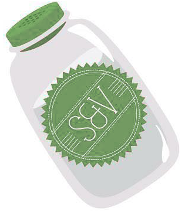

# Salt and Vinegar

Manage what we want and should buy.

## Features

* [x] Get one safe URL for papers.
* [x] Add items into a paper async.
* [x] Edit items async.
* [x] Save own name.
* [ ] Make a new paper with the same URL.
* [x] See recent papers.
* [x] Show example pages.
* [ ] Remember item prices.
* [ ] Show prices' sum.
* [ ] Manage payments.

## Requires

* Usable (both show and edit) on PCs and mobiles.
* Without logging in.
* Easy and speedy editing.
* Safety URLs.
* High conflict toughness. (Really?)

## Scenario

### Basic Shopping in a Share House

1. Initialize
    1. An owner made a new *book* (includes the first *paper*).
    2. Share its URL.
2. First Purchases
    1. Tenants write each requests as *items* into the *paper*.
    2. The owner watches the *paper* on own phone and marks *items* at a store.
    3. Tenants get each requested items.
3. Another Purchases
    1. The owner *turns* a *paper*.
    2. Tenants write each requests as *items* into the *paper*.
    3. The owner watches the *paper* on own phone and marks *items* at a store.
    4. Tenants get each requested items.

### Prices

1. The owner watches the *paper* on own phone and marks *items* at a store.
2. After buying, the owner inputs each prices on the *paper*.
3. Tenants get each requested items and check them prices on the *paper*.
4. The paper shows each item's prices and these sum.
